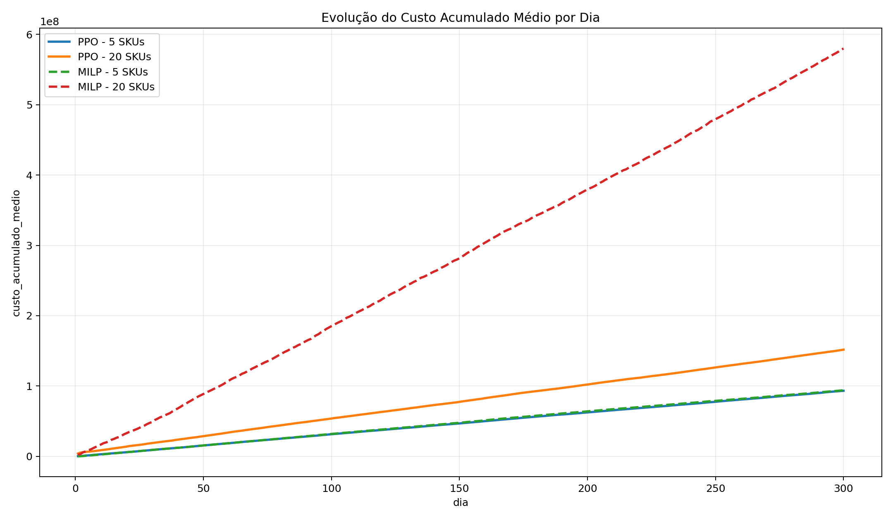
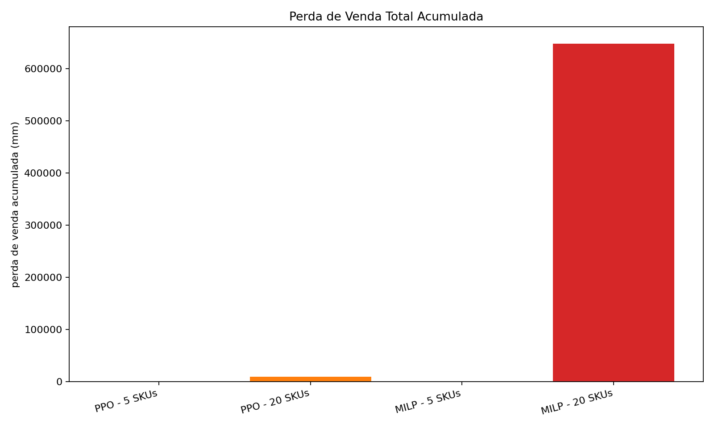

# Reinforcement learning vs MILP for dynamic steel coil cutting

B.Sc. thesis in Mechanical Engineering, concentration in Production Engineering,
Federal University of Santa Catarina (UFSC), defended in December 2025.
Advisor: Prof. Lynceo Falavigna Braghirolli.

## The problem

A cutting line turns 1200 mm steel coils into pieces of several sizes (SKUs) to stock.
Every day the planner picks cutting patterns from a catalog, with limited capacity
(50 sheets per day) and a cap on setups, while demand is random.
Cut too little and you lose sales. Cut too much and inventory piles up.
Pick the wrong patterns and you create trim loss.

## Approach

- **Simulator** (Gymnasium): 300-day horizon, stochastic demand (negative binomial,
  SKUs grouped by order frequency), costs per mm of 700 for a lost sale, 35 for trim
  loss and 3 for inventory.
- **Baseline**: a mixed-integer linear program (MILP) solved day by day with PuLP and
  CBC, using the same pattern catalog, costs and capacity.
- **Agent**: PPO (Stable-Baselines3). State: inventory per SKU, observed demand and
  remaining resources. Action: a cutting pattern and how much to run it.
  Reward: minus the daily cost.
- **Scenarios**: 5 SKUs and 20 SKUs, four independent runs each.

## Results

Average per day:

| Indicator | MILP, 5 SKUs | PPO, 5 SKUs | MILP, 20 SKUs | PPO, 20 SKUs |
|---|---:|---:|---:|---:|
| Cost | 313,169 | 310,837 | 1,933,140 | 505,762 |
| Trim loss (mm) | 7,251 | 7,476 | 3,749 | 5,453 |
| Inventory (mm) | 19,795 | 16,048 | 94,970 | 94,765 |
| Lost sales (mm) | 0.00 | 1.49 | 2,159.59 | 32.42 |

With 5 SKUs both methods perform about the same. With 20 SKUs the PPO agent cut the
average daily cost by **73.8%** and lost sales by **98.5%** compared with the MILP,
at a similar inventory level. The day-by-day MILP has no view of the days ahead;
the agent learned to build safety stock before demand shows up.





Charts are labeled in Portuguese, as in the thesis. All charts are in
[docs/figures](docs/figures).

## Repository layout

```
train.py              training, evaluation and MILP baseline (CLI)
simulate_demand.py    generates and inspects demand scenarios
src/env.py            Gymnasium environment
src/milp.py           daily MILP model (PuLP)
src/demand*.py        stochastic demand generator
configs/              experiment settings (costs, capacity, PPO hyperparameters)
data/                 SKU catalogs and cutting pattern catalogs (5 and 20 SKUs)
results/              summary of the runs reported in the thesis
docs/                 thesis (PDF, Portuguese) and figures
```

## How to run

```
pip install -r requirements.txt
python train.py --env medio --mode train --timesteps 200000 --eval-milp --make-plots
```

`--env pequeno` runs the 5-SKU scenario and `--env medio` the 20-SKU scenario.
Outputs (models, CSVs and charts) are written to `reports/`. Tested with Python 3.11.

## Thesis

Full text in Portuguese: [docs/thesis_pt-BR.pdf](docs/thesis_pt-BR.pdf)

*Aprendizado por reforço aplicado ao problema dinâmico de corte de bobinas: comparação
entre agentes PPO e programação linear inteira* (Reinforcement learning applied to the
dynamic coil cutting problem: a comparison between PPO agents and integer linear
programming).
